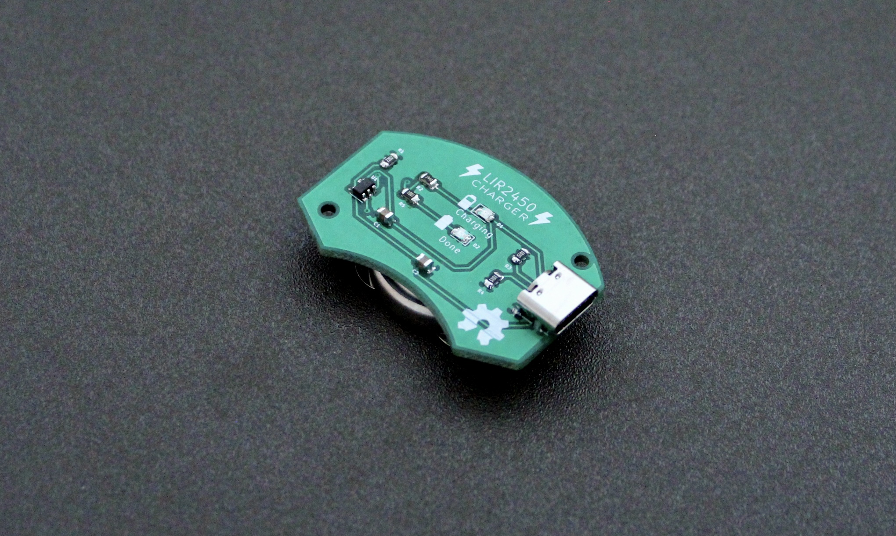
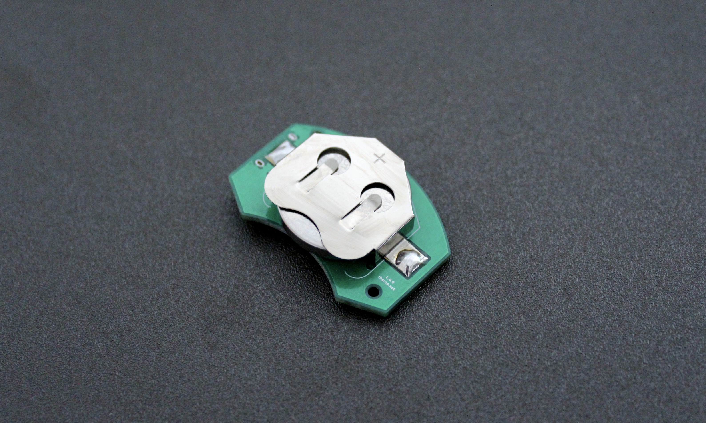
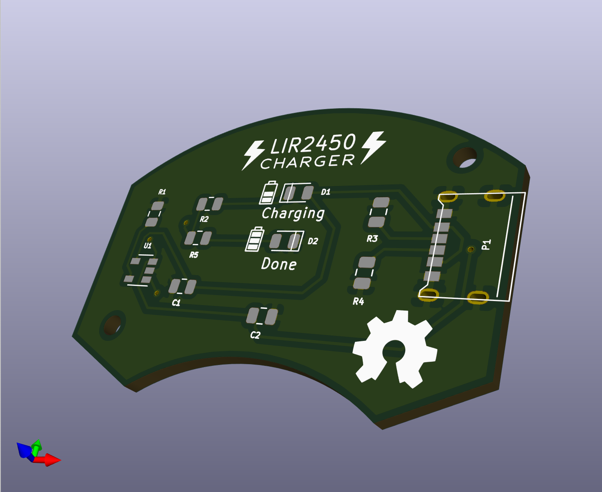

# LIR2450 Charger

An open source USB C battery charger for [LIR2450 Li-Ion coin cells](https://www.adafruit.com/product/1572).

This repo hosts the [KiCad](https://kicad.org/) project for the charger, which contains the schematic and printed circuit board layout so you can make your own.

# Tech Specs
* It uses Microchip's [MCP73831](https://www.microchip.com/wwwproducts/en/en024903) as the charge management controller. It guarantees the appropriate charging curve for LiPo/Li-Ion cells (constant current/constant voltage - CC/CV)
* The charge current is set to ~45mA via the 22k R1 resistor

# 3D Render

# License
The hardware and associated design files are released under the [Creative Commons CC BY-SA 4.0 license](https://creativecommons.org/licenses/by-sa/4.0/).